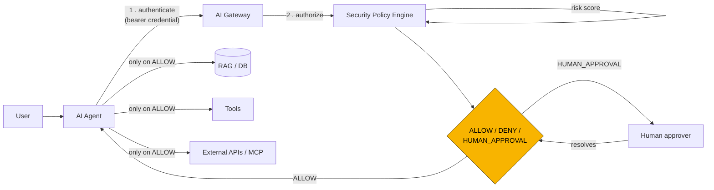

# AegisAI -- Runtime Security Gateway for Autonomous AI Agents

[](https://github.com/ara-5/AI-Runtime-Security-Zero-Trust-Agent-Platform/actions/workflows/ci.yml)

A zero-trust security layer that sits between AI agents and everything they
can touch (databases, tools, external APIs), so that a compromised or
misbehaving agent is still bounded by verified identity, IAM permissions,
declarative policy, risk scoring, and human sign-off -- not by its own
judgment.

**The question this answers:** *"Can I prevent a compromised AI agent from
doing damage?"* See [docs/ARCHITECTURE.md](docs/ARCHITECTURE.md) for the
full design writeup.



For every action: **who's calling** (verified, not claimed)? Which agent?
What permissions? What resource? What data? What's the risk? -> **ALLOW /
DENY / HUMAN_APPROVAL**.

## What's here

- **Agent authentication** (`gateway/identity/credentials.py`) -- every
  agent holds a bearer secret; the gateway verifies it before any policy
  logic runs. Fails closed: no credentials configured means every request
  is rejected.
- **Agent IAM** (`gateway/identity/`) -- Human -> Agent -> Tool identity
  chain with per-resource permission grants (`agents.yaml`).
- **Security Policy Engine** (`gateway/policy/`) -- declarative rules
  (`rules.yaml`) plus a composite risk-scoring fallback.
- **Runtime detectors** (`gateway/security/`) -- DLP, prompt-injection
  heuristics, behavioral anomaly detection (call-rate, repeated denials --
  including repeated *authentication* failures).
- **Human-approval workflow** (`gateway/approvals/`) -- `HUMAN_APPROVAL`
  actions are parked, not executed, until a human resolves them.
- **Observability** (`gateway/audit/`, `gateway/telemetry/`) -- structured
  JSON audit log (SIEM-ready), OpenTelemetry tracing, Prometheus metrics,
  an auto-provisioned Grafana dashboard.
- **AI Gateway** (`gateway/main.py`) -- the FastAPI service everything above
  is wired into.
- **Demo agent + tools** (`agent/`) -- a small agent runtime that calls the
  gateway before ever touching a (simulated) tool.

## Quickstart

```powershell
python -m venv .venv
.venv\Scripts\Activate.ps1
pip install -r requirements.txt

# once, mints a bearer credential per registered agent
python scripts\generate_agent_keys.py

# terminal 1
uvicorn gateway.main:app --reload

# terminal 2
python scripts\demo.py
```

The demo walks through every scenario from the design brief against the
live gateway:

| # | Action | Expected decision |
|---|--------|--------------------|
| 1 | customer-support-agent reads a customer profile | ALLOW |
| 2 | customer-support-agent sends an email | ALLOW |
| 3 | customer-support-agent exports 50,000 records | DENY (bulk-export rule) |
| 4 | customer-support-agent reads `secrets.api_key` | DENY (secret-access rule) |
| 5 | data-ops-agent deletes the production database | HUMAN_APPROVAL -> then approved |
| 6 | (bonus) prompt-injection payload in a tool input | risk score spikes, findings logged |
| 7 | (bonus) 26 rapid calls from one agent | anomaly detector flags excessive call rate |
| 8 | (bonus) caller claims to be data-ops-agent with a forged key | 401, rejected before policy even runs |

Then check:
- `logs/audit.log` -- every decision as a structured JSON line
- `http://127.0.0.1:8000/metrics` -- Prometheus metrics
- `http://127.0.0.1:8000/v1/approvals` -- pending human-approval queue
- `http://127.0.0.1:8000/v1/agents` -- the registered agent identities and their permissions

## Run the full stack (gateway + Prometheus + Grafana)

```bash
python scripts/generate_agent_keys.py   # required before first `up`
docker compose up --build
```

- Gateway: http://localhost:8000
- Prometheus: http://localhost:9090
- Grafana: http://localhost:3000 -- the Prometheus data source and the
  **AegisAI — Zero-Trust Gateway Overview** dashboard are both auto-provisioned
  (`grafana/provisioning/`, `grafana/dashboards/`), so it's populated on first
  load with no manual setup: request volume and deny rate, ALLOW/DENY/HUMAN_APPROVAL
  split, average risk score, security findings by category, policy rule matches,
  and pending approvals. Anonymous viewer access is enabled for the demo; log in
  as admin/admin to edit.

  Run `python scripts\demo.py` (or hit the gateway however you like) while the
  stack is up and the dashboard fills in live.

## Tests

```bash
pytest
```

24 tests: the policy engine directly (deterministic, no server needed), risk
scoring, and the HTTP layer -- including authentication -- via FastAPI's
`TestClient`. Runs in CI on every push (see badge above).

## Try your own policy

Add or edit a rule in `gateway/policy/rules.yaml` -- no code change needed:

```yaml
- name: block_weekend_admin_actions
  when:
    action: admin
  then: HUMAN_APPROVAL
  reason: "Admin-level actions always require a human, regardless of risk score."
```

Or register a new agent with scoped permissions in
`gateway/identity/agents.yaml`, then re-run
`python scripts/generate_agent_keys.py` to mint its credential.

## Extending toward production

See [docs/ARCHITECTURE.md](docs/ARCHITECTURE.md#roadmap--future-proofing)
for a longer brainstorm, but the short list:

- Swap the in-memory `ApprovalManager` / `AnomalyTracker` for a shared store
  (Postgres/Redis) once the gateway runs as more than one instance.
- Replace bearer-key auth with mTLS or SPIFFE/SPIRE workload identity for
  cryptographic, short-lived, auto-rotated agent credentials.
- Point `OTEL_EXPORTER_OTLP_ENDPOINT` at a real collector (Jaeger/Tempo).
- Ship `logs/audit.log` to your SIEM (Splunk/Elastic) via its standard
  log-forwarding agent -- the JSON schema is already flat and queryable.
- Replace the regex-based DLP/prompt-injection detectors with a classifier,
  Presidio, or an LLM-judge model behind the same `scan(text) -> (hits,
  score)` contract.
