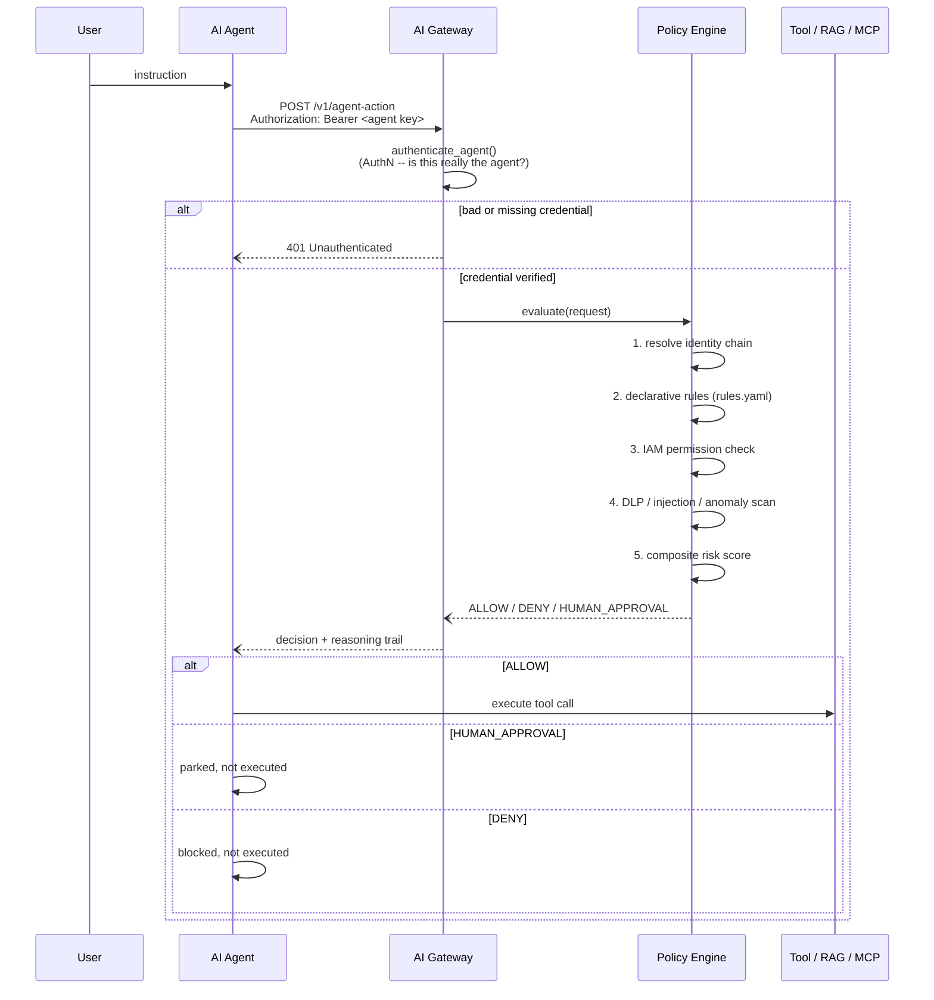
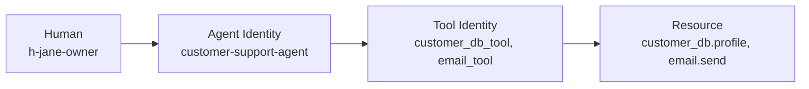

# AegisAI Architecture

## The question this project answers

Not "can I stop a prompt injection" but: **if an agent is already compromised
-- jailbroken, fed a malicious tool result, or simply buggy -- can it still
do damage?** AegisAI's answer is to never let the agent's own judgment be the
last line of defense. Every action it wants to take is re-checked, from
scratch, against an external policy engine that the agent cannot see or
influence -- and it has to prove who it is before any of that even starts.

## Request flow



Nothing after the gateway is trusted implicitly. The agent process itself
holds no standing credentials to the database, email provider, or payments
system -- it can only ask the gateway, and the gateway decides.

## Identity chain (Agent IAM)



Every `ActionRequest` carries all four links. The registry
(`gateway/identity/registry.py`, backed by `gateway/identity/agents.yaml`)
resolves each one and rejects the request outright if the agent is unknown
or the tool isn't in that agent's `allowed_tools` list -- before any policy
or risk logic even runs.

Permissions are scoped per resource category, not "the agent can use this
tool":

```yaml
agent: customer-support-agent
permissions:
  customer_db: { read: true, write: false, export: false }
  email:       { send: true }
  payments:    { read: false, write: false }
  filesystem:  { access: false }
```

A compromised customer-support-agent cannot escalate into writing the
customer DB or touching payments no matter what it's told to do -- the grant
simply isn't there.

## Authentication vs. authorization

These are deliberately two separate layers, because conflating them is the
gap that makes an IAM system decorative:

- **AuthN** (`gateway/identity/credentials.py`, enforced in
  `gateway/main.py`'s `authenticate_agent` dependency) -- proves the caller
  actually *is* the `agent_id` it claims to be, via a bearer credential
  whose SHA-256 hash the gateway holds. This runs first, before the request
  body is handed to anything else. No credentials configured -> every
  request is rejected (fail closed).
- **AuthZ** (the policy engine, described below) -- once identity is
  proven, decides what that specific, verified agent is allowed to do.

Without the first layer, `agent_id` in a request body is just an unverified
string -- anything on the network could claim to be `data-ops-agent` and
inherit its permissions. A failed authentication attempt is itself a
security signal: it's logged as a `security_alert` and counted by the same
anomaly tracker that watches for repeated policy denials, so credential
spraying against a known agent ID shows up as `repeated_failed_authorization`
just like probing for a permission it doesn't have.

## Policy engine

Three layers, evaluated in order:

1. **Declarative rules -- real policy-as-code.** The hard guardrails
   ("never allow secret access", "production deletes require a human") are
   written as Rego (`gateway/policy/rego/guardrails.rego`) and evaluated by
   a live **OPA** server when `OPA_URL` is configured. The policy has its
   own independent test suite (`gateway/policy/rego/guardrails_test.rego`,
   run with `opa test`) -- it's verified as policy, not just as an
   assertion buried in a Python test. If OPA is unreachable or not
   configured, `gateway/policy/engine.py` falls back transparently to an
   equivalent local YAML rule matcher (`rules.yaml`) -- same guardrails,
   zero infrastructure required. Every decision's `reasons` carry an
   `[opa]` prefix when OPA made the call, so which path fired is always
   visible, not just assumed.
2. **IAM permission check** (below) -- runs after the declarative layer for
   anything it didn't already resolve.
3. **Risk-score fallback** (`gateway/policy/risk.py`) -- for everything not
   already covered by a hard rule, a weighted score combines action
   severity, data classification, record volume, destination, and live
   security findings (DLP hits, prompt-injection indicators, behavioral
   anomalies) into a single 0-1 score, thresholded into ALLOW (<0.4),
   HUMAN_APPROVAL (0.4-0.75), or DENY (>=0.75).

Every decision returns a full reasoning trail (`reasons`, `matched_rules`,
`findings`) -- nothing is a black box.

## Runtime security detectors (`gateway/security/`)

- `dlp.py` -- regex-based scan for secrets, API keys, credit cards, SSNs in
  any payload the agent is about to move.
- `prompt_injection.py` -- heuristic pattern matching for jailbreak/override
  markers in tool inputs or retrieved content.
- `anomaly.py` -- sliding-window tracker per agent for excessive call rate
  and repeated failures (denied policy checks *and* failed authentication --
  both classic exfiltration/probing signals).

These feed the risk score; they are signals, not the enforcement mechanism
itself -- verified identity, the IAM permission check, and declarative rules
are what actually gate access.

## Human-in-the-loop approvals

A `HUMAN_APPROVAL` decision does not execute anything. It's parked in
`gateway/approvals/manager.py` as a pending record; the action only runs
after an authorized human calls `POST /v1/approvals/{id}/decision`. The
gateway enforces this by construction -- the demo agent only invokes the
tool on an `ALLOW` response, never on `HUMAN_APPROVAL`.

## Shared state and durability

Two components hold state across requests, and both have an in-memory
implementation (correct for exactly one process) and a shared-backend
implementation (correct for a fleet), selected automatically by whether an
environment variable is set -- there's no separate "production mode" to
remember to configure:

- **Anomaly tracking** (`gateway/security/anomaly.py`) -- `AnomalyTracker`
  (in-memory, `collections.deque`) or `RedisAnomalyTracker` (Redis sorted
  sets, score = timestamp) when `REDIS_URL` is set. Without this, an
  attacker spread across two gateway replicas looks like two separate,
  under-threshold callers to each -- the whole point of a sliding-window
  detector breaks under horizontal scaling unless the window is shared.
- **Approval queue** (`gateway/approvals/manager.py`) -- `ApprovalManager`
  (in-memory dict) or `RedisApprovalManager` (JSON records + a Redis set
  for the pending index) when `REDIS_URL` is set. Without this, an approval
  created on instance A is invisible to a human trying to resolve it
  against instance B.
- **Durable audit trail** (`gateway/audit/postgres_store.py`) -- when
  `DATABASE_URL` is set, every decision is dual-written to a Postgres
  `decisions` table alongside the JSON log. Deliberately best-effort: a
  Postgres outage logs a warning and the request still completes, because
  the JSON log -- not this table -- is the audit-of-record. This exists so
  "how many DENYs did billing-agent get this week" is a SQL query instead
  of a script that parses a log file.

## Observability

- **Structured audit log** (`gateway/audit/logger.py`) -- every decision is
  one JSON line in `logs/audit.log`, with `DENY`s driven by a security rule
  or high risk score (and every authentication failure) tagged
  `security_alert`. Point a SIEM's log shipper at this file (or swap the
  handler for syslog/HTTP) and you have alerting with no extra glue code.
- **OpenTelemetry** (`gateway/telemetry/otel.py`) -- every gateway request
  is a span carrying the identity chain and decision as attributes.
  Defaults to console export; set `OTEL_EXPORTER_OTLP_ENDPOINT` to ship to
  Jaeger/Tempo/etc.
- **Prometheus** (`gateway/telemetry/metrics.py`, served at `/metrics`) --
  request counts by decision, rule-match counts, risk-score distribution,
  security-finding counts, pending-approval gauge. `docker-compose.yml`
  wires up Prometheus to scrape it and Grafana to visualize it, with the
  data source and an overview dashboard auto-provisioned from
  `grafana/provisioning/` and `grafana/dashboards/` -- no manual setup.

## Why this is a deeper problem than prompt filtering

A prompt-injection filter tries to stop the *input* from corrupting the
agent's behavior. AegisAI assumes that will sometimes fail and asks a
different question at the *output* side: even if the agent's behavior is
fully corrupted, is there still a hard boundary -- verified identity,
permission, declarative policy, human sign-off -- that keeps it from
causing damage? That's Agent IAM and zero-trust, not content filtering.

## Roadmap / Future-Proofing

What's here is deliberately a working, testable core, not a finished
product. Ranked roughly by how much it would change the story if you
picked one to build next.

### Done

These were roadmap items in an earlier revision of this doc; they're real,
running code now, not just described here:

- **Policy-as-code via OPA/Rego** -- see the Policy engine section above.
  Independently unit-tested (`opa test`), CI-verified against a live OPA
  container, with an automatic local-YAML fallback so the zero-infra
  quickstart still works.
- **Redis-backed shared state** for the anomaly tracker and approval
  queue -- see Shared state and durability above.
- **Postgres-backed durable audit trail** -- dual-written alongside the
  JSON log, additive and best-effort.
- **Standards mapping** -- [docs/COMPLIANCE_MAPPING.md](COMPLIANCE_MAPPING.md)
  maps AegisAI's actual controls (and gaps) against the OWASP LLM Top 10
  and NIST AI RMF.

Deliberately *not* attempted, and why: **Kafka/NATS event bus** was
considered alongside Redis/Postgres but would have been redundant with
them for this project's scope -- Postgres already makes the audit trail
queryable and Redis already makes state shared; an event bus earns its
complexity once there are multiple independent downstream consumers, which
this project doesn't have yet. **gVisor/Firecracker sandboxing** and
**eBPF/Falco monitoring** need kernel-level primitives (KVM, a Linux host)
that aren't available under Docker Desktop on Windows, so building them
here would mean untested, unverifiable code -- worse than not building
them. They stay below as real next steps, not abandoned ideas.

### Identity & auth -- the highest-leverage remaining gap
- **SPIFFE/SPIRE workload identity** instead of static bearer-key hashes --
  short-lived, automatically-rotated X.509 SVIDs per agent process, the
  standard primitive for zero-trust service-to-service auth. This turns "a
  secret the agent holds" into "a cryptographic identity the platform
  issues and revokes," and is the single biggest thing left undone in this
  project.
- Watch the **emerging "agent identity" standards** space -- it's forming
  right now: Microsoft Entra Agent ID, Okta/Auth0 cross-app access for
  GenAI, the IETF WIMSE (Workload Identity in Multi-System Environments)
  draft. Being able to say "this maps to WIMSE" is a strong signal you
  understand where the industry is headed, not just where it is.
- mTLS between the agent runtime and the gateway as a lower-effort
  intermediate step before a full workload-identity system.

### Protocol-level integration
- Wrap **real MCP (Model Context Protocol) servers** so the gateway
  intercepts actual MCP tool-call requests/responses instead of the
  simulated `agent/tools/`. Makes the demo map 1:1 onto how agents built on
  Claude (or anything else speaking MCP) actually call tools today.
- Front a real agent runtime -- Anthropic's Agent SDK / Tool Runner,
  LangGraph, CrewAI -- instead of the toy `AegisAgent` class, with AegisAI
  as the tool-call middleware every framework already has a hook for.

### Detection quality
- Regex DLP/prompt-injection are an honest v1 signal, not the enforcement
  mechanism -- but they're easy to evade by anyone who knows the patterns.
  Natural upgrades: **Microsoft Presidio** for proper NER-based PII/DLP
  detection, or an **LLM-as-judge** pattern (a small, fast model classifies
  payload risk) behind the same `scan(text) -> (hits, score)` contract, or
  a guardrails framework (NeMo Guardrails, Llama Guard).

### Defense in depth beyond the decision
- Execute tool calls that get an `ALLOW` inside an isolated sandbox
  (gVisor, Firecracker microVMs, or WASM) so a bug in a tool's own
  implementation can't itself become an escalation path -- the gateway's
  decision shouldn't be the only thing standing between an agent and
  damage. Needs a Linux host with the right kernel primitives -- not
  buildable under Docker Desktop on Windows, which is why it's still on
  the roadmap instead of in the codebase.
- eBPF-based runtime monitoring (e.g., Falco) as an OS-level layer beneath
  the application-level gateway, for the case where an agent gets to
  execute code directly rather than going through a tool call. Same
  host-platform constraint as above.

None of this changes what's already here -- the current gateway, tests, and
demo stand on their own. This section is a map of what "production-hardened"
would look like next, roughly in the order it would change the project's
story.
